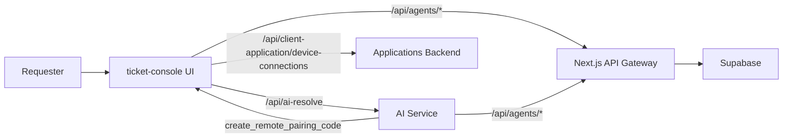

 # Changes Since Yesterday — Architecture & Code Review
 
 ## 1) Previous Architecture (Before Changes)
 
 ### AI Interaction Flow
 - `ticket-console` had two AI paths:
   - `/api/ai-resolve` used OpenAI Responses API directly (Next.js).
   - `/api/chat/message` proxied to Python AI Service (ai-service).
 - AI service directly accessed Supabase (no gateway).
 
 ### Remote Connection Flow
 - Remote device system (Applications backend) existed but not connected to AI.
 - AI agent could not initiate remote device pairing or diagnostics.
 
### Workflow Diagram (Previous)

```mermaid
flowchart LR
  user[Requester] --> tc[ticket-console UI]
  tc -->|/api/ai-resolve| openai[OpenAI Responses API]
  tc -->|/api/chat/message| aisvc[AI Service]
  aisvc --> supabase[Supabase (direct)]
  tc --> supabase
  apps[Applications Backend] -. no AI integration .- aisvc
```

 ### Pain Points
 - Two separate AI systems caused inconsistent behavior.
 - Direct DB access from AI service lacked unified gateway/auth.
 - Remote pairing code generation was not available to AI.
 
 ---
 
 ## 2) Current Architecture (After Changes)
 
 ### Unified AI Flow
 - AI Service is the single backend for AI logic.
 - `ticket-console` now uses the Python AI Service for `/api/ai-resolve` tasks.
 - Next.js is the API gateway for all data access.
 
 ### Remote Connection Flow (Partial)
 - AI can now identify devices and generate 6-digit pairing codes.
 - Remote troubleshooting tools added to AI pipeline.
 
 ### High-Level Architecture
 
 ```
 ticket-console (Next.js)
    |
    |  /api/ai-resolve  --> Python AI Service
    |
    +--> /api/agents/* (API Gateway)
            |
            -> Supabase
 
 Python AI Service
    |
    +--> /api/chat, /api/classify
    +--> /api/agents/* via API Gateway
    +--> create_remote_pairing_code -> /api/client-application/device-connections
 ```
 
### Workflow Diagram (Current)



 ---
 
 ## 3) Code Changes (Key Files & Why)
 
 ### A) AI Service
 
 #### `ai-service/db/queries.py`
 - Added: `create_remote_pairing_code`
 - Updated: `get_device_by_name_for_org` now returns `device_id`
 - Why:
   - Needed to generate 6-digit pairing codes.
   - Avoid agent guessing device IDs.
 
 #### `ai-service/app_agents/device_agent.py`
 - Exposed: `create_remote_pairing_code`
 - Why:
   - Allow device agent to initiate pairing codes.
 
 #### `ai-service/app_agents/triage_agent.py`
 - Prompt updates:
   - Remote connection requests are supported.
   - Must list devices, confirm, lookup device_id, then generate code.
   - Strict rule: never hallucinate codes.
   - Skip `create_contact` if `contact_id` already exists in session context.
 - Why:
   - Prevent “I will generate code” loops.
   - Stop fake codes and ensure real tool use.
 
 #### `ai-service/agents/pipeline.py`
 - Safeguard:
   - After device lookup succeeds, auto-call `create_remote_pairing_code` only if remote intent is present.
 - Why:
   - Model skipped tool calls despite prompt rules.
   - Ensures code creation only when intent is real.
 
 #### `ai-service/lib/api_client.py`
 - Fix: return full response if `data` field is missing.
 - Why:
   - `/create-six-digit-code` returns top-level fields, causing NoneType errors.
 
 ---
 
 ### B) Ticket Console (Next.js)
 
 #### `ticket-console/src/app/api/ai-resolve/route.ts`
 - Migrated from OpenAI Responses API to AI Service.
 - Now uses:
   - `/api/classify` for triage
   - `/api/chat` for generation, satisfaction, intent
 - Why:
   - Single AI backend for consistency.
   - Unified tools & DB access via gateway.
 
 #### API Gateway additions
 - `/api/agents/*` routes for orgs, contacts, devices, tickets, device-connections.
 - Why:
   - AI Service should not call Supabase directly.
 
 ---
 
 ## 4) Remote Connection Enhancements
 
 ### New tool
 - `create_remote_pairing_code` -> `/api/client-application/device-connections/create-six-digit-code`
 
 ### Improved Device Resolution
 - `get_device_by_name_for_org` now returns `device_id`
 - prevents wrong device assumptions.
 
 ---
 
 ## 5) Fixes Implemented
 
 - OpenAI JSON errors in Next.js prompts.
 - Missing `contact_id` in JWT fixed with fallback in `ChatWindow`.
 - Session handling (`/api/chat/start`) supports passing session IDs.
 - Prevented hallucinated codes and repeated “please hold” loops.
 
 ---
 
 ## 6) Why We Made These Changes
 
 | Issue | Fix | Outcome |
 |------|-----|--------|
 | Two AI systems | Use AI Service only | Single source of truth |
 | Direct Supabase access | API Gateway | Secure and centralized access |
 | Remote connect unsupported | Add pairing tool | AI can initiate pairing |
 | Device mismatch | Include device_id in lookup | Correct pairing |
 | Hallucinated codes | Prompt + pipeline safeguard | Reliable pairing |
 
 ---
 
 ## 7) Current Status
 
 - AI Service generates pairing codes with correct device_id.
 - Uses Next.js API gateway for DB access.
 - `/api/ai-resolve` uses AI Service backend.
 - Prompt tightened to prevent fake codes.
 

